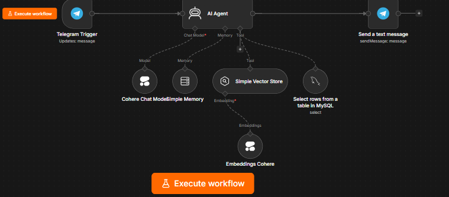

# 🤖 HR Buddy: Agente de IA Híbrido (RAG + SQL) para Recursos Humanos

Este repositorio contiene la arquitectura, el flujo de orquestación y los scripts de datos para **HR Buddy**, un asistente virtual avanzado de Recursos Humanos para la empresa ficticia *ChocolaTech*. El proyecto implementa un enfoque de IA híbrido que combina la potencia de la generación asistida por recuperación (RAG) para datos no estructurados con consultas dinámicas a bases de datos relacionales (SQL) para datos estructurados.

---

## 🏗️ Arquitectura del Sistema

El flujo completo ha sido diseñado y desplegado utilizando **n8n** como motor de orquestación visual, integrando componentes de **LangChain** para la gestión del agente de IA, modelos de lenguaje de **Cohere** y almacenamiento en la nube a través de **Railway**.

A continuación se detalla el flujo de trabajo (workflow) implementado:



---

## 🧠 Pilares Técnicos e Implementación

El desarrollo de este agente se estructuró en tres etapas de aprendizaje e ingeniería:

### 1. Ingestión de Conocimiento y Arquitectura RAG (Datos No Estructurados)
Para permitir que la IA responda con base en un contexto real y corporativo, evadiendo las alucinaciones comunes de los LLM, se implementó una arquitectura **RAG (Retrieval-Augmented Generation)**:
* **Flujo de Ingestión (Load Data Flow):** Se procesó el *Manual de RH de ChocolaTech* (texto plano) para actuar como la fuente primaria de verdad.
* **Transformación mediante Embeddings:** Se utilizó el modelo `embed-multilingual-v3.0` de **Cohere** para convertir los bloques de texto no estructurados en vectores numéricos (embeddings) que capturan el significado semántico de las políticas de la empresa.
* **Base de Datos Vectorial:** Los vectores se almacenan en un `Simple Vector Store` (en memoria), configurado en modo *Retrieve-as-Tool*, permitiendo al agente realizar búsquedas semánticas eficientes en tiempo real cuando el usuario realiza consultas generales sobre vacaciones, beneficios o normativas.

### 2. Integración Relacional y Parámetros Dinámicos (Datos Estructurados)
Un agente empresarial requiere interactuar con datos transaccionales precisos. Este proyecto resuelve la convergencia entre datos estructurados y no estructurados:
* **Separación de Capas de Datos:** A diferencia del manual corporativo (no estructurado), la información crítica de los empleados (saldos de vacaciones, banco de horas, modalidades de trabajo) reside en una base de datos relacional **MySQL** alojada en **Railway**.
* **Parámetros Dinámicos con `$fromAI`:** Se configuró la herramienta de MySQL en n8n para realizar búsquedas parciales inteligentes. Mediante la función de expresión de n8n:
    ```javascript
    ={{ /*n8n-auto-generated-fromAI-override*/ $fromAI('values0_Value', `usa siempre el formato %nombre% para busqueda parcial. Por ejemplo %Eric Moné%`, 'string') }}
    ```
    El agente extrae de manera autónoma el nombre del empleado desde la conversación en lenguaje natural, formatea la cadena con comodines SQL (`%`) y ejecuta un filtro `LIKE` de manera segura y dinámica.
* **Fusión RAG + SQL:** El agente orquesta ambas herramientas de manera inteligente. Si el usuario solicita información personal, consulta MySQL; si la consulta es sobre políticas globales, recurre al Vector Store.

### 3. Despliegue en Producción, Guardrails y Memoria
Llevar el agente al mundo real requirió robustez en la comunicación y el control del comportamiento:
* **Conectividad vía Webhook:** El flujo se inicia mediante un `Telegram Trigger`, configurado como un webhook activo que escucha, procesa y responde mensajes de forma asíncrona.
* **Gestión de Memoria Aislada por Usuario:** Para evitar el cruce de contextos en entornos multiusuario, se implementó un nodo `Simple Memory` (Window Buffer) indexado dinámicamente mediante el ID único del chat de Telegram:
    ```javascript
    sessionKey: {{ $json.message.from.id }}
    ```
    Esto garantiza que el agente recuerde el nombre del usuario y el hilo de la conversación de forma estrictamente aislada.
* **Implementación de Guardrails:** Mediante el *System Prompt*, se establecieron filtros estrictos de contención:
    * **Restricción de Dominio:** El agente solo responde dudas estrictamente relacionadas con RR. HH.
    * **Identificación Obligatoria:** Si el usuario no se identifica, el sistema exige el nombre completo antes de activar la herramienta de MySQL.
    * **Protección contra Alucinaciones:** Si un empleado no existe en el sistema SQL, el agente tiene prohibido inventar datos personales y se limita a dar soporte con las reglas generales del manual.

---

## 📁 Estructura del Repositorio

```text
📁 telegram-ai-agent-workflow/
├── 📄 README.md                     # Documentación técnica principal
├── 📁 n8n/
│   └── 📄 telegram_ai_agent.json    # Estructura del flujo exportada de n8n
├── 📁 sql/
│   ├── 📄 01_schema.sql             # Estructura DDL de la tabla 'empleados'
│   └── 📄 02_seed_data.sql          # Datos ficticios de prueba (Seed Data)
├── 📁 knowledge_base/
│   └── 📄 manual_rh_chocolatech.txt # Base de conocimiento para el Vector Store
├── 📁 prompts/
│   └── 📄 system_instructions.md    # System Prompt e instrucciones del Agente
└── 📁 assets/
    └── 📄 architecture.png          # Captura de la arquitectura del flujo
```


## 🛠️ Requisitos e Instalación

1. **Clonar el repositorio:**
   ```bash
   git clone https://github.com/JuanPa-Portugal/telegram-ai-agent-workflow.git
   ```
2. **Base de Datos:** Importa los archivos de la carpeta `sql/` en tu instancia de MySQL (en Railway o local) para desplegar la tabla con los datos semilla.
3. **Importar en n8n:** Crea un flujo nuevo en tu instancia de n8n e importa el archivo `n8n/telegram_ai_agent.json`.
4. **Credenciales:** Configura tus credenciales seguras para los nodos de **Telegram API**, **Cohere API** y **MySQL**.
5. **Activar:** Cambia el estado del flujo a *Active* para levantar el Webhook.
